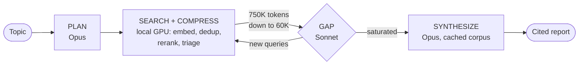

<div align="center">

# Quarry-LDR

**Local deep research: a local GPU compresses the web into dense evidence, Claude reasons over it.**

*Quarry, as in the place you dig raw material out of; LDR for local deep research.*

<sub><b>Language & AI</b></sub>

      

<sub><b>Data & Infrastructure</b></sub>

       

<sub><b>Tooling</b></sub>

      

</div>

## What it is

Quarry-LDR takes a research topic and produces a cited markdown report through an iterative loop: plan, search, fetch, index, rerank, extract, find gaps, search again, synthesize. The design rests on one insight: the local GPU is a compression layer, not a brain. Its job is to turn roughly 750K tokens of raw scraped text into roughly 60K tokens of deduplicated, reranked evidence. The Anthropic API is then called on that small, high signal payload for the work that actually needs intelligence.

Every claim in a report carries a citation that resolves to a source URL and chunk offsets. Every run is checkpointed to SQLite, so an interrupted run resumes from its last completed stage instead of restarting. Every API call lands in a cost ledger computed from the API's own usage blocks.

| Approach | What happens | Cost per report |
| --- | --- | --- |
| Naive (All API) | ~750K raw tokens through Opus for triage and synthesis | $10 to $15 |
| Hybrid (Quarry-LDR) | Local GPU embeds, dedups, reranks, triages; ~60K tokens to API | $1.36 to $2.88 measured |

The measured numbers come from the first live validation runs; [docs/FirstRunReport.md](docs/FirstRunReport.md) breaks down where every cent went and what the failures taught. Everything was built and tested end to end on one laptop card, an NVIDIA RTX 5060 Mobile with 8 GB of VRAM.

## How it works



A 14-stage checkpointed pipeline: one Opus call plans sub-questions, SearXNG and a polite fetcher gather sources, and the local GPU embeds, deduplicates, reranks, and triages them down to a token-budgeted evidence corpus. A Sonnet gap check then decides whether to loop, and Opus writes the report section by section over one prompt-cached corpus. A VRAM arbiter with a hard 6.5 GB budget owns all GPU residency so three models share one 8 GB card safely. Diagram, arbiter rules, and every configuration key: [docs/Architecture.md](docs/Architecture.md).

## Run it

Prerequisites: an NVIDIA GPU (8 GB VRAM or more recommended), Docker Desktop or Docker Engine for SearXNG, and an Anthropic API key.

```bash
git clone https://github.com/vignesh-nagarajan-vn/Quarry-LDR
cd Quarry-LDR
make bootstrap                # fresh Windows without GNU make: powershell -ExecutionPolicy Bypass -File scripts/bootstrap.ps1
cp .env.example .env          # paste your ANTHROPIC_API_KEY
make searxng                  # starts local search in Docker
uv run python scripts/download_models.py   # fetches llama-server and the triage GGUF
uv run quarry verify          # preflight check with remediation hints
uv run quarry research "your topic"
```

The report lands in `data/reports/`, with a cost ledger and a run manifest appended. `quarry resume <run_id>` continues an interrupted run; `quarry inspect <run_id>` dumps stage-by-stage state. `make smoke` runs a capped end-to-end rehearsal first if you want proof before spending on a real topic.

## Documentation

- [docs/Architecture.md](docs/Architecture.md): pipeline diagram, VRAM arbiter, hardware design target, full configuration reference, API pricing the ledger uses.
- [docs/FirstRunReport.md](docs/FirstRunReport.md): the live validation story; measured costs, the bugs only production could find, and what each dollar bought.
- [docs/ExampleReport.md](docs/ExampleReport.md): a real report the pipeline produced during validation, on dealer quoting as a performative fixed-point problem; $2.88 of API spend, verbatim except punctuation.
- [docs/Troubleshooting.md](docs/Troubleshooting.md): symptoms, causes, and exact fixes.
- [CLAUDE.md](CLAUDE.md): invariants and operating rules for coding sessions.
- [COMMIT.md](COMMIT.md): the commit contract.
- [DECISIONS.md](DECISIONS.md): every design decision and measured deviation.

## Contributing

Read [CLAUDE.md](CLAUDE.md) for the invariants (they are enforced by tests) and [COMMIT.md](COMMIT.md) for the commit contract. Run `make verify` before any PR: format, lint, type check, and the CPU-only test suite must pass without network or an API key.

## License

MIT. See [LICENSE](LICENSE).
