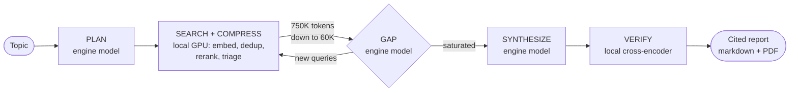
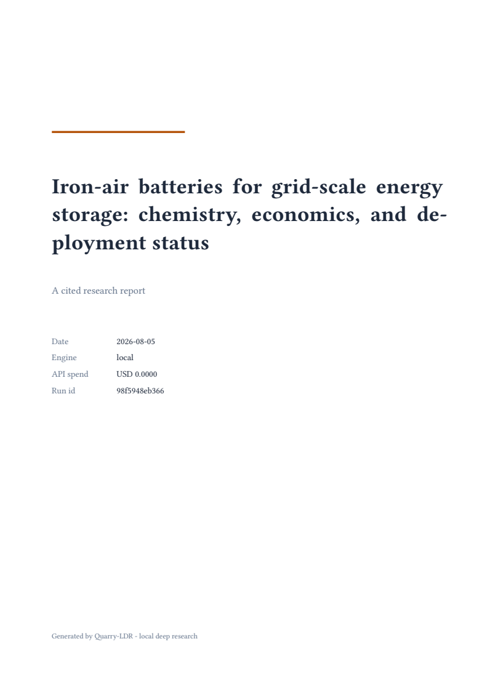
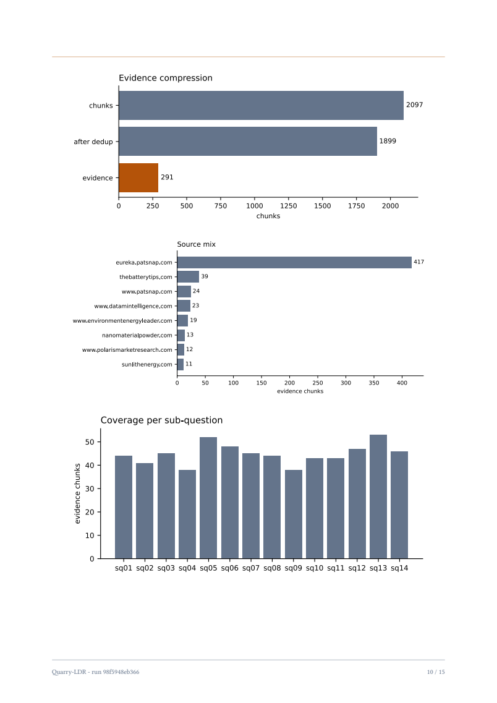

<div align="center">

# Quarry-LDR

**Local deep research: a local GPU compresses the web into dense evidence and, by default, writes and verifies the cited report itself. Claude remains an optional engine.**

*Quarry, as in the place you dig raw material out of; LDR for local deep research.*

<sub><b>Language & AI</b></sub>

        

<sub><b>Data & Infrastructure</b></sub>

         

<sub><b>Tooling</b></sub>

       

</div>

## What It Is

Quarry-LDR takes a research topic and produces a cited report through an iterative loop: plan, search, fetch, index, rerank, extract evidence, find gaps, search again, synthesize, verify. The design rests on one insight: the local GPU is a compression layer that turns roughly 750K tokens of raw scraped text into roughly 60K tokens of deduplicated, reranked evidence. Since v1 the GPU is also the brain by default: an 8B model plans the research and writes the report section by section, a 4B model triages evidence and audits coverage, and a cross-encoder verifies every cited sentence against its sources. A default run makes zero API calls and needs no API key.

The `engine.mode` setting decides who does the reasoning:

| Engine | What happens | API cost per report |
| --- | --- | --- |
| Naive (no Quarry) | ~750K raw tokens through Opus | $10 to $15 |
| `premium` | local GPU compresses; Claude plans, audits gaps, writes | $1.36 to $2.88, measured |
| `assisted` | local plan and draft; Haiku 4.5 gap checks and one polish pass | $0.02 to $0.12, measured |
| `local` (default) | everything runs on your GPU | $0.00 |

Every claim in a report carries a citation that resolves to a source URL and chunk offsets, and must survive an entailment check against the cited text before render: sentences the evidence does not support are rewritten or dropped. Reports ship as markdown plus a branded PDF with run charts. Every run is checkpointed to SQLite, so an interrupted run resumes from its last completed stage. Every API call lands in a cost ledger computed from the API's own usage blocks, and local model calls are ledgered the same way at zero price, so the $0.00 is enforced, not asserted.

The premium numbers come from the v0 live validation runs; [docs/first-test/FirstRunReport.md](docs/first-test/FirstRunReport.md) breaks down where every cent went and what the failures taught. Everything runs end to end on one laptop card, an NVIDIA RTX 5060 Mobile with 8 GB of VRAM, where the 8B writer generates at a measured 35.3 tokens per second.

Two lines of the project exist, one per design generation:

| Branch | Version | What it is |
| --- | --- | --- |
| [`main`](https://github.com/vignesh-nagarajan-vn/Quarry-LDR) | v1.0.0 | The v1 local-first line: your GPU plans, writes, and verifies by default at $0.00 in API spend, with `assisted` and `premium` as paid engine tiers and a branded PDF beside every report |
| [`archive/v0-hybrid-api`](https://github.com/vignesh-nagarajan-vn/Quarry-LDR/tree/archive/v0-hybrid-api) | [v0.9.0-beta](https://github.com/vignesh-nagarajan-vn/Quarry-LDR/releases/tag/v0.9.0-beta) | The original hybrid design, preserved as released: the local GPU compresses the web and Claude does all the reasoning, at a measured $1.36 to $2.88 per report |

## How It Works



A 15-stage checkpointed pipeline. The engine model behind **PLAN**, **GAP**, and **SYNTHESIZE** is **Qwen3-8B** on your own GPU by default, or Claude in the assisted and premium modes; either way SearXNG and a polite fetcher gather sources, and the local GPU embeds, deduplicates, reranks, and triages them down to a token-budgeted evidence corpus. The local models run as **Q4_K_M GGUF quantizations** (4-bit k-quant medium) via llama.cpp: the 8B writer at 16K context with flash attention and a q8_0-quantized KV cache, the 4B triage model at 8K context. The embedder (bge-m3) and the cross-encoder reranker (bge-reranker-v2-m3) run unquantized at fp16.

In local mode the 8B writes each section from a **per-section evidence slice** with grammar-constrained output, and gap checks run on the already-resident 4B so the loop never pays a model swap; in premium mode Claude writes over one **prompt-cached corpus** exactly as v0 did. **VERIFY** then scores every cited sentence against its cited chunks and rewrites or drops what the evidence does not support. A **VRAM arbiter** with a hard 6.5 GB budget owns all GPU residency so four models share one 8 GB card safely. Diagram, arbiter rules, and every configuration key: [docs/Architecture.md](docs/Architecture.md).

## Run It

Prerequisites: an NVIDIA GPU (8 GB VRAM or more recommended) and Docker Desktop or Docker Engine for SearXNG. An Anthropic API key is needed only for the `assisted` and `premium` engines; the default `local` engine runs without one.

```bash
git clone https://github.com/vignesh-nagarajan-vn/Quarry-LDR
cd Quarry-LDR
make bootstrap                # fresh Windows without GNU make: powershell -ExecutionPolicy Bypass -File scripts/bootstrap.ps1
cp .env.example .env          # optional: paste ANTHROPIC_API_KEY for assisted/premium
make searxng                  # starts local search in Docker
uv run python scripts/download_models.py   # fetches llama-server and both GGUFs
uv run quarry verify          # preflight check with remediation hints
uv run quarry research "your topic"
```

That default run is the `local` engine: $0.00, no API key. To buy Claude reasoning instead, put `ANTHROPIC_API_KEY` in `.env` and pick the engine per run:

```bash
uv run quarry research "your topic" --engine assisted   # Haiku gap audits + polish, $0.02 to $0.12 measured
uv run quarry research "your topic" --engine premium    # Claude plans, audits, writes; $1.36 to $2.88 measured
```

(or set it permanently with `engine.mode` in a config file). The report and its PDF land in `data/reports/`, with a cost ledger and a run manifest appended. `quarry resume <run_id>` continues an interrupted run; `quarry inspect <run_id>` dumps stage-by-stage state. `make smoke-local` runs a $0 end-to-end rehearsal first if you want proof before a real topic, and `make smoke` does the same on the configured engine under a $2.00 cap. Every flag, engine, config knob, and operational caution, in one place: [docs/RunGuide.md](docs/RunGuide.md).

What $0.00 buys, verbatim from [a real local-engine run](pdf-reports/):

| The branded cover | The run appendix |
| :---: | :---: |
| [](pdf-reports/iron-air-batteries-local-engine.pdf) | [](pdf-reports/iron-air-batteries-local-engine.pdf) |

## Documentation

- [docs/RunGuide.md](docs/RunGuide.md): the complete run guide; setup, all three engines with commands and measured costs, configuration, resume, rehearsals, operational cautions.
- [pdf-reports/](pdf-reports/): sample PDF reports straight from the pipeline, one local ($0.00) and one assisted ($0.06), with the numbers behind each.
- [docs/Architecture.md](docs/Architecture.md): pipeline diagram, engine modes, VRAM arbiter, hardware design target, full configuration reference, API pricing the ledger uses.
- [docs/first-test/](docs/first-test/): the v0 live validation record; [FirstRunReport.md](docs/first-test/FirstRunReport.md) breaks down measured costs and the bugs only production could find, and [ExampleReport.md](docs/first-test/ExampleReport.md) is the $2.88 premium report it produced, verbatim except punctuation.
- [docs/Troubleshooting.md](docs/Troubleshooting.md): symptoms, causes, and exact fixes.
- [CLAUDE.md](CLAUDE.md): the full operating context; purpose, architecture map, invariants, commit contract, and working rules for humans and agents.
- [DECISIONS.md](DECISIONS.md): every design decision and measured deviation.

## Contributing

Read [CLAUDE.md](CLAUDE.md) first: it carries the invariants (they are enforced by tests), the commit contract, and the working conventions. Run `make verify` before any PR: format, lint, type check, and the CPU-only test suite must pass without network or an API key.

## Acknowledgements

The v1 local-first direction is inspired by [local-deep-research](https://github.com/LearningCircuit/local-deep-research) (MIT), which showed how far a fully local research pipeline can go; Quarry-LDR shares no code with it and takes a framework-free path. Where Quarry-LDR goes further is rigor:

- Every cited sentence must survive a cross-encoder entailment check before render; what the evidence does not support is rewritten or dropped.
- The $0.00 default is enforced, not asserted: a ledger meters local calls exactly like API calls, with real token counts at zero price.
- The whole stack, from search through an 8B writer to verification, fits one 8 GB laptop card under a hard VRAM budget with LRU eviction.
- Every run checkpoints to SQLite, so interruptions resume from the last completed stage instead of starting over.

## License

MIT. See [LICENSE](LICENSE).
