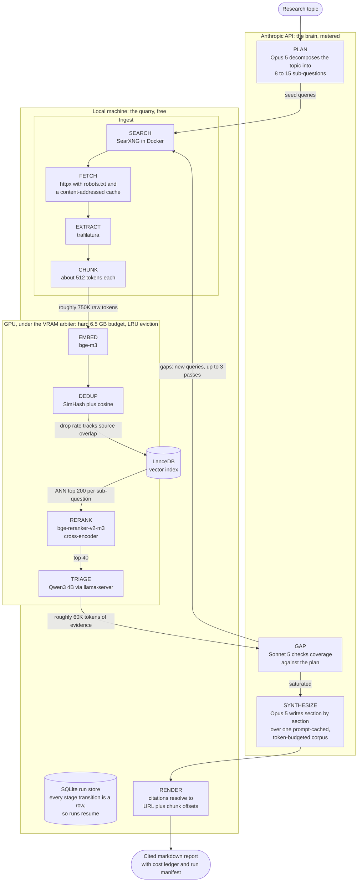

# Architecture

How Quarry-LDR turns a topic into a cited report, what owns the GPU, what hardware it is designed for, and every configuration key.

## Pipeline

The complete architecture, and which side of the cost line each stage runs on:



Stage by stage:

```
topic
  |
  v
[PLAN]        Opus 5, one call. 8 to 15 sub-questions, each with
              seed queries and a success criterion.
  |
  v
[SEARCH]      Local SearXNG in Docker. Free per query; concurrency is
              bounded so upstream engines never see a burst.
  |
  v
[FETCH]       httpx, robots.txt respected, per-domain rate limit,
              content-addressed disk cache. Never fetch a URL twice.
  |
  v
[EXTRACT]     trafilatura. Boilerplate-free text plus heading structure.
  |
  v
[CHUNK]       Token-aware, ~512 tokens, 64 overlap, heading path kept.
  |
  v
[EMBED]       Local GPU. Batched. Thousands of chunks.
  |
  v
[DEDUP]       Local GPU. Cosine similarity plus SimHash shingling.
              Drop rate tracks source overlap: 0 to 3 percent measured
              on diverse live corpora, far higher on duplicate-heavy topics.
  |
  v
[RETRIEVE]    LanceDB ANN. Top 200 per sub-question.
  |
  v
[RERANK]      Local GPU cross-encoder. 200 candidates down to 40.
              The single highest leverage quality lever in the system.
  |
  v
[TRIAGE]      Local 4B model. Per-chunk structured JSON:
              {relevant, claim, evidence_span, confidence}
  |
  v
[GAP]         Sonnet 5. Coverage versus the plan's success criteria.
  |          |
  |          +---> loop back to SEARCH (max iterations, default 3)
  v
[SYNTHESIZE]  Opus 5, section by section, over one prompt-cached corpus
              trimmed to report.corpus_budget_tokens beforehand.
  |
  v
[RENDER]      Markdown report with numbered citations resolving to
              URL plus chunk anchor, a cost ledger, and a run manifest.
```

Every stage transition is a row in a SQLite run store, so `quarry resume <run_id>` replays completed stages from their persisted payloads and re-executes only unfinished work.

## The VRAM arbiter

All GPU residency is owned by a VRAM arbiter with a hard budget (default 6.5 GB): it loads models on demand, evicts by LRU, and serializes access so the embedder, reranker, and local LLM never fight over 8 GB. Stages are batched by model, never interleaved, because eviction and reload are expensive.

The arbiter measures real VRAM before and after every load and corrects declared footprints against reality, with one guard: a measurement under 25 percent of the declared footprint is treated as implausible and the declared value stands. This matters on Windows, where WDDM hides a child process's VRAM (llama-server) from `mem_get_info`.

## Hardware design target

Quarry-LDR is designed for a laptop NVIDIA RTX 5060 Mobile: 8 GB GDDR7, Blackwell architecture, compute capability `sm_120`. Three constraints from that card shape the whole system:

- **Blackwell needs CUDA 12.8 or newer kernels.** Older PyTorch and llama.cpp builds do not ship `sm_120` kernels; the project pins the cu128 PyTorch wheel index. `scripts/verify_gpu.py` proves a real matmul executes on device.
- **8 GB VRAM, about 7 GB usable after the OS cut**, hence the 6.5 GB arbiter budget. Partial offload decodes an order of magnitude slower over PCIe, so the arbiter enforces full residency or refuses to load.
- **Laptops throttle.** Sustained multi-hour load runs well below burst benchmarks; actual tokens per second are logged so you can see it, and `scripts/bench_vram.py` measures footprints and throughput on your card.

Any CUDA GPU with compute capability 8.0 or newer also works: `verify_gpu.py` checks capability at least (8, 0), and you should set `gpu.vram_budget_mb` to about 80 percent of your card's VRAM. `DECISIONS.md` carries two measured baselines: the desktop RTX 4060 (`sm_89`) development PC (nDCG regression, llama-server latency) and the RTX 5060 Mobile (`sm_120`) deployment laptop (footprints, sustained throughput, and the one-time PTX JIT cost of the cuda-12.4 llama.cpp build on Blackwell).

## Configuration reference

Defaults live in `config/default.yaml`; identical defaults are baked into the code so a missing file never breaks a run. Override with a `--config your.yaml` layer or `QUARRY_<SECTION>__<KEY>` environment variables.

| Key | Default | What changes if you move it |
| --- | --- | --- |
| `run.max_iterations` | 3 | More loops find more evidence, cost one Sonnet gap call each plus search time |
| `run.cost_cap_usd` | 5.0 | Hard API spend cap; the ledger raises mid-run when crossed |
| `run.data_dir` | `data` | Where cache, index, run DB, logs, and reports live |
| `run.models_dir` | `models` | Local weights and the llama.cpp server binary (`download_models.py`) |
| `models.plan` | `claude-opus-5` | Planning model; cheaper models produce weaker decompositions |
| `models.gap` | `claude-sonnet-5` | Runs every iteration, keep it cheap |
| `models.synthesize` | `claude-opus-5` | The one place maximum capability pays for itself |
| `models.extract_fallback` | `claude-haiku-4-5-20251001` | Bulk extraction fallback via Batch API |
| `models.embedder` | `BAAI/bge-m3` | Swap for `Qwen/Qwen3-Embedding-0.6B` to trade quality for VRAM |
| `models.reranker` | `BAAI/bge-reranker-v2-m3` | The quality lever; changing this changes evidence quality most |
| `models.triage_gguf_repo` / `_file` | Qwen3 4B Q4_K_M | Local triage model; must fit VRAM entirely |
| `gpu.vram_budget_mb` | 6656 | Hard arbiter budget; set to ~80 percent of your card's VRAM |
| `gpu.footprints_mb.*` | embedder 2186, reranker 2128, triage 3600 | Declared per-model VRAM, measured on the 5060 Mobile; corrected by `scripts/bench_vram.py` |
| `gpu.embed_batch_size` | 32 | Bigger is faster until it OOMs |
| `gpu.rerank_batch_size` | 16 | Same trade as embed batch |
| `search.searxng_url` | `http://localhost:8888` | Point at any SearXNG with JSON enabled |
| `search.results_per_query` | 10 | More results per query, more fetching per iteration |
| `search.timeout_s` | 15.0 | Per search request |
| `search.max_concurrency` | 4 | Concurrent queries against SearXNG; bursts get upstream engines suspended |
| `fetch.user_agent` | QuarryLDR/0.1 (+repo URL) | Identifying UA; keep it honest |
| `fetch.per_domain_rps` | 1.0 | Politeness rate per domain |
| `fetch.max_concurrency` | 8 | Global concurrent fetches |
| `fetch.timeout_s` | 20.0 | Per fetch |
| `fetch.max_bytes` | 5000000 | Oversized responses are rejected |
| `fetch.cache_dir` | `data/cache/fetch` | Content-addressed body cache; safe to delete |
| `chunk.target_tokens` | 512 | Bigger chunks, fewer boundaries, coarser citations |
| `chunk.overlap_tokens` | 64 | Overlap between consecutive chunks |
| `chunk.min_tokens` | 48 | Trailing fragments below this merge backward |
| `dedup.cosine_threshold` | 0.92 | Lower drops more near-duplicates |
| `dedup.simhash_hamming_max` | 3 | Higher drops more near-duplicates |
| `retrieve.ann_top_k` | 200 | ANN candidates per sub-question |
| `retrieve.rerank_top_k` | 40 | Evidence kept per sub-question after rerank |
| `triage.context_tokens` | 8192 | llama-server context; bigger costs VRAM (KV cache) |
| `triage.port` | 8555 | llama-server port |
| `triage.max_retries` | 2 | Retries for malformed JSON from the local model |
| `triage.confidence_floor` | 0.3 | Verdicts below this are dropped |
| `api.max_retries` | 5 | Backoff retries on 429/529 |
| `api.retry_base_s` | 1.0 | Exponential backoff base with jitter |
| `api.cache_ttl` | `1h` | Prompt cache TTL for the synthesis corpus |
| `api.batch_poll_s` | 30.0 | Batch API poll interval |
| `report.min_sections` / `max_sections` | 4 / 12 | Report shape bounds |
| `report.corpus_budget_tokens` | 45000 | Synthesis evidence cap in heuristic tokens (~60K API tokens at the measured 1.32x ratio); round-robin across sub-questions by rerank score |

## API pricing the ledger uses

Prices in USD per million tokens, used verbatim by the cost ledger:

| Model | Input | Output | Batch in | Batch out | 1h cache write | Cache read |
| --- | --- | --- | --- | --- | --- | --- |
| `claude-opus-5` | $5 | $25 | $2.50 | $12.50 | $10 | $0.50 |
| `claude-sonnet-5` | $2 | $10 | $1.00 | $5.00 | $4 | $0.20 |
| `claude-haiku-4-5-20251001` | $1 | $5 | $0.50 | $2.50 | $2 | $0.10 |

Two caveats the ledger encodes:

- Sonnet 5 pricing above is introductory through August 31, 2026, then becomes $3 in, $15 out. The pricing table is date aware, so ledgers stay accurate after the change.
- Claude 4.7 and later use a tokenizer that produces roughly 30 percent more tokens for the same text. Costs are always computed from the `usage` block the API returns, never from character counts.

Measured per-report economics, including where the money goes inside a run, are in [FirstRunReport.md](FirstRunReport.md).
