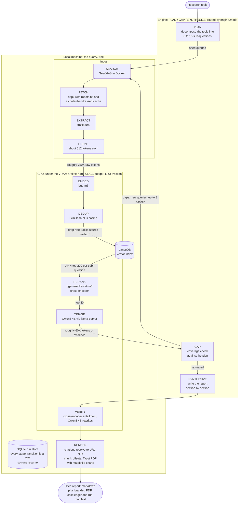

# Architecture

How Quarry-LDR turns a topic into a cited report, which engine does the reasoning, what owns the GPU, what hardware it is designed for, and every configuration key.

## Pipeline

The complete architecture. The engine tier decides who serves PLAN, GAP, and SYNTHESIZE; everything else always runs locally:



Stage by stage, with the model behind each engine-routed stage per mode:

```
topic
  |
  v
[PLAN]        Engine model, one call. 8 to 15 sub-questions, each with
              seed queries and a success criterion.
              local/assisted: Qwen3 8B   premium: Opus 5
  |
  v
[SEARCH]      Local SearXNG in Docker. Free per query; concurrency is
              bounded so upstream engines never see a burst.
  |
  v
[FETCH]       httpx, robots.txt respected, per-domain rate limit,
              content-addressed disk cache. Never fetch a URL twice.
  |
  v
[EXTRACT]     trafilatura. Boilerplate-free text plus heading structure.
  |
  v
[CHUNK]       Token-aware, ~512 tokens, 64 overlap, heading path kept.
  |
  v
[EMBED]       Local GPU. Batched. Thousands of chunks.
  |
  v
[DEDUP]       Local GPU. Cosine similarity plus SimHash shingling.
              Drop rate tracks source overlap: 0 to 3 percent measured
              on diverse live corpora, far higher on duplicate-heavy topics.
  |
  v
[RETRIEVE]    LanceDB ANN. Top 200 per sub-question.
  |
  v
[RERANK]      Local GPU cross-encoder. 200 candidates down to 40.
              The single highest leverage quality lever in the system.
  |
  v
[TRIAGE]      Local 4B model. Per-chunk structured JSON:
              {relevant, claim, evidence_span, confidence}
  |
  v
[GAP]         Coverage versus the plan's success criteria.
              local: Qwen3 4B (already resident, zero model swaps)
              assisted: Haiku 4.5   premium: Sonnet 5
  |          |
  |          +---> loop back to SEARCH (max iterations, default 3)
  v
[SYNTHESIZE]  local/assisted: Qwen3 8B writes each section from a
              per-section evidence slice with grammar-constrained
              output; assisted adds one guarded Haiku polish pass.
              premium: Opus 5 over one prompt-cached corpus trimmed
              to report.corpus_budget_tokens beforehand.
  |
  v
[VERIFY]      Local GPU, every engine mode. The cross-encoder scores
              every cited sentence against its cited chunks in one
              batched pass; sentences under verify.floor get up to
              verify.max_rewrites rewrite attempts on the 4B model,
              then are dropped if still failing.
  |
  v
[RENDER]      Markdown report with numbered citations resolving to
              URL plus chunk anchor, a cost ledger, and a run manifest;
              plus a branded Typst PDF with matplotlib run charts
              (report.pdf, fail-soft: the markdown never depends on it).
```

Every stage transition is a row in a SQLite run store, so `quarry resume <run_id>` replays completed stages from their persisted payloads and re-executes only unfinished work. A run resumed under a different `engine.mode` continues under the new engine from that point; the config snapshot is persisted for the record but not re-applied.

## Engine modes

`engine.mode` routes the three reasoning stages; everything else is identical across modes:

| | `local` (default) | `assisted` | `premium` |
| --- | --- | --- | --- |
| PLAN | Qwen3 8B | Qwen3 8B | Opus 5 |
| GAP | Qwen3 4B | Haiku 4.5 | Sonnet 5 |
| SYNTHESIZE | Qwen3 8B per section | Qwen3 8B + one Haiku polish pass | Opus 5, prompt-cached corpus |
| VERIFY | always local | always local | always local |
| API key | not needed | required | required |
| API cost per report | $0.00 | $0.02 to $0.12 measured | $1.36 to $2.88 measured |

Notes that matter in practice:

- Local calls are ledgered like API calls, at zero price, under `local/<gguf-file>` model ids with real token counts from llama-server's usage block. The $0.00 is enforced by the same accounting that meters premium, not asserted.
- In local and assisted modes the synth server starts before PLAN, so GPU work begins at the first stage. Local GAP runs on the triage 4B while it is already resident, costing zero llama-server swaps per loop iteration.
- The assisted polish pass is guarded: the citation-marker multiset must survive exactly and the section delimiters must round-trip, else the polish result is discarded with a warning and the local draft stands.
- `quarry verify` (preflight) is engine-aware: a missing API key is a skip line in local mode and a failure otherwise; the synth GGUF is required unless the engine is premium.

## The VRAM arbiter

All GPU residency is owned by a VRAM arbiter with a hard budget (default 6.5 GB): it loads models on demand, evicts by LRU, and serializes access so the embedder, reranker, and local LLMs never fight over 8 GB. Stages are batched by model, never interleaved, because eviction and reload are expensive.

The synth 8B model (declared 6400 MB) fits the budget only alone, so the arbiter always runs it solo; the reranker and the triage 4B fit together, which is what makes VERIFY's rewrite pass free of extra evictions. The arbiter measures real VRAM before and after every load and corrects declared footprints against reality, with one guard: a measurement under 25 percent of the declared footprint is treated as implausible and the declared value stands. This matters on Windows, where WDDM hides a child process's VRAM (llama-server) from `mem_get_info`.

## Hardware design target

Quarry-LDR is designed for a laptop NVIDIA RTX 5060 Mobile: 8 GB GDDR7, Blackwell architecture, compute capability `sm_120`. Three constraints from that card shape the whole system:

- **Blackwell needs CUDA 12.8 or newer kernels.** Older PyTorch and llama.cpp builds do not ship `sm_120` kernels; the project pins the cu128 PyTorch wheel index. `scripts/verify_gpu.py` proves a real matmul executes on device.
- **8 GB VRAM, about 7 GB usable after the OS cut**, hence the 6.5 GB arbiter budget. Partial offload decodes an order of magnitude slower over PCIe, so the arbiter enforces full residency or refuses to load. The 8B writer is the budget's ceiling tenant: measured true footprint 5912 MiB at 16384 context with flash attention and q8_0 KV cache, declared 6400 MB.
- **Laptops throttle.** Sustained multi-hour load runs well below burst benchmarks; actual tokens per second are logged so you can see it, and `scripts/bench_vram.py` measures footprints and throughput on your card. Measured on the design target: the 8B writer generates at 35.3 tokens per second.

Any CUDA GPU with compute capability 8.0 or newer also works: `verify_gpu.py` checks capability at least (8, 0), and you should set `gpu.vram_budget_mb` to about 80 percent of your card's VRAM. `DECISIONS.md` carries two measured baselines: the desktop RTX 4060 (`sm_89`) development PC (nDCG regression, llama-server latency) and the RTX 5060 Mobile (`sm_120`) deployment laptop (footprints, sustained throughput, and the one-time PTX JIT cost of the cuda-12.4 llama.cpp build on Blackwell).

## Configuration reference

Defaults live in `config/default.yaml`; identical defaults are baked into the code so a missing file never breaks a run. Override with a `--config your.yaml` layer or `QUARRY_<SECTION>__<KEY>` environment variables.

| Key | Default | What changes if you move it |
| --- | --- | --- |
| `engine.mode` | `local` | Who serves PLAN/GAP/SYNTHESIZE: `local` ($0, no key), `assisted`, `premium`; `--engine` overrides per run |
| `run.max_iterations` | 3 | More loops find more evidence, cost one gap call each plus search time |
| `run.cost_cap_usd` | 5.0 | Hard API spend cap; the ledger raises mid-run when crossed |
| `run.data_dir` | `data` | Where cache, index, run DB, logs, and reports live |
| `run.models_dir` | `models` | Local weights and the llama.cpp server binary (`download_models.py`) |
| `models.plan` | `claude-opus-5` | Premium planning model; cheaper models produce weaker decompositions |
| `models.gap` | `claude-sonnet-5` | Premium gap model; runs every iteration, keep it cheap |
| `models.synthesize` | `claude-opus-5` | Premium writer; the one place maximum capability pays for itself |
| `models.assisted` | `claude-haiku-4-5-20251001` | Assisted-mode gap checks and the one polish pass |
| `models.extract_fallback` | `claude-haiku-4-5-20251001` | Bulk extraction fallback via Batch API |
| `models.embedder` | `BAAI/bge-m3` | Swap for `Qwen/Qwen3-Embedding-0.6B` to trade quality for VRAM |
| `models.reranker` | `BAAI/bge-reranker-v2-m3` | The quality lever; also VERIFY's entailment judge |
| `models.triage_gguf_repo` / `_file` | Qwen3 4B Q4_K_M | Local triage model; also local GAP and VERIFY rewrites |
| `models.synth_gguf_repo` / `_file` | `Qwen/Qwen3-8B-GGUF` Q4_K_M | The local writer; must fit VRAM entirely, alone |
| `gpu.vram_budget_mb` | 6656 | Hard arbiter budget; set to ~80 percent of your card's VRAM |
| `gpu.footprints_mb.*` | embedder 2186, reranker 2128, triage 3600, synth 6400 | Declared per-model VRAM, measured on the 5060 Mobile; corrected by `scripts/bench_vram.py` |
| `gpu.embed_batch_size` | 32 | Bigger is faster until it OOMs |
| `gpu.rerank_batch_size` | 16 | Same trade as embed batch |
| `search.searxng_url` | `http://localhost:8888` | Point at any SearXNG with JSON enabled |
| `search.results_per_query` | 10 | More results per query, more fetching per iteration |
| `search.timeout_s` | 15.0 | Per search request |
| `search.max_concurrency` | 4 | Concurrent queries against SearXNG; bursts get upstream engines suspended |
| `fetch.user_agent` | QuarryLDR/1.0 (+repo URL) | Identifying UA; keep it honest |
| `fetch.per_domain_rps` | 1.0 | Politeness rate per domain |
| `fetch.max_concurrency` | 8 | Global concurrent fetches |
| `fetch.timeout_s` | 20.0 | Per fetch |
| `fetch.max_bytes` | 5000000 | Oversized responses are rejected |
| `fetch.cache_dir` | `data/cache/fetch` | Content-addressed body cache; safe to delete |
| `chunk.target_tokens` | 512 | Bigger chunks, fewer boundaries, coarser citations |
| `chunk.overlap_tokens` | 64 | Overlap between consecutive chunks |
| `chunk.min_tokens` | 48 | Trailing fragments below this merge backward |
| `dedup.cosine_threshold` | 0.92 | Lower drops more near-duplicates |
| `dedup.simhash_hamming_max` | 3 | Higher drops more near-duplicates |
| `retrieve.ann_top_k` | 200 | ANN candidates per sub-question |
| `retrieve.rerank_top_k` | 40 | Evidence kept per sub-question after rerank |
| `triage.context_tokens` | 8192 | Triage llama-server context; bigger costs VRAM (KV cache) |
| `triage.port` | 8555 | Triage llama-server port |
| `triage.max_retries` | 2 | Retries for malformed JSON from the local model |
| `triage.confidence_floor` | 0.3 | Verdicts below this are dropped |
| `triage.request_timeout_s` | 120.0 | Per-request ceiling against the triage server |
| `synth.context_tokens` | 16384 | Synth llama-server context; the per-section budget must fit inside it |
| `synth.port` | 8556 | Synth llama-server port |
| `synth.max_retries` | 2 | Retries for malformed JSON from the local writer |
| `synth.flash_attn` | true | Flash attention for the synth server |
| `synth.kv_cache_type` | `q8_0` | KV cache quantization; halves KV memory at negligible quality cost |
| `synth.reasoning_budget` | 0 | Disables Qwen3 thinking mode; sections need prose, not deliberation |
| `synth.section_budget_tokens` | 6000 | Per-section evidence cap in heuristic tokens |
| `synth.section_max_tokens` | 2048 | Per-section generation cap |
| `synth.request_timeout_s` | 300.0 | Per-request ceiling; sized for a full-corpus section on a throttled card |
| `verify.enabled` | true | Score every cited sentence against its cited chunks before render |
| `verify.floor` | -8.0 | Cross-encoder logit floor, calibrated on fixtures (DECISIONS.md); raise for stricter reports, lower to keep more |
| `verify.max_rewrites` | 2 | Rewrite attempts on the 4B before a failing sentence is dropped |
| `api.max_retries` | 5 | Backoff retries on 429/529 |
| `api.retry_base_s` | 1.0 | Exponential backoff base with jitter |
| `api.cache_ttl` | `1h` | Prompt cache TTL for the synthesis corpus |
| `api.batch_poll_s` | 30.0 | Batch API poll interval |
| `report.min_sections` / `max_sections` | 4 / 12 | Report shape bounds |
| `report.corpus_budget_tokens` | 45000 | Synthesis evidence cap in heuristic tokens (~60K API tokens at the measured 1.32x ratio); round-robin across sub-questions by rerank score |
| `report.pdf` | true | Compile the branded Typst PDF beside the markdown; failures are fail-soft |

## API pricing the ledger uses

Prices in USD per million tokens, used verbatim by the cost ledger:

| Model | Input | Output | Batch in | Batch out | 1h cache write | Cache read |
| --- | --- | --- | --- | --- | --- | --- |
| `claude-opus-5` | $5 | $25 | $2.50 | $12.50 | $10 | $0.50 |
| `claude-sonnet-5` | $2 | $10 | $1.00 | $5.00 | $4 | $0.20 |
| `claude-haiku-4-5-20251001` | $1 | $5 | $0.50 | $2.50 | $2 | $0.10 |

Any model id under the `local/` prefix is priced at zero in every column; local rows still carry real token counts from llama-server's usage block, so the ledger stays one honest table across engines.

Two caveats the ledger encodes:

- Sonnet 5 pricing above is introductory through August 31, 2026, then becomes $3 in, $15 out. The pricing table is date aware, so ledgers stay accurate after the change.
- Claude 4.7 and later use a tokenizer that produces roughly 30 percent more tokens for the same text. Costs are always computed from the `usage` block the API returns, never from character counts.

Measured per-report economics, including where the money goes inside a run, are in [first-test/FirstRunReport.md](first-test/FirstRunReport.md).
